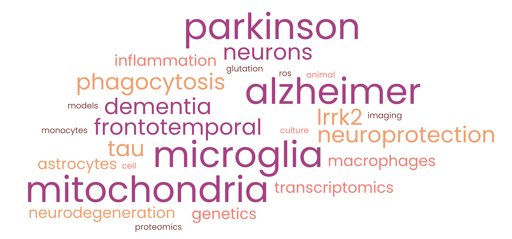

```{=html}
<style type="text/css">
.title {
  display: none;
}

main-container {
  max-width: 1800px;
  margin-left: auto;
  margin-right: auto;
}

body {
text-align: justify
}

</style>
```
<div class="row" style="padding-top: 30px;">

# **Neuroscience lab**

## *Understanding the role of mitochondria and microglia in the development of neurodegenerative diseases*

<a href = "https://www.ucm.es/">  </a>

</br>

We are **Elisa Navarro & Noemí Esteras**, two young PIs joining forces to deepen in the understanding of neurodegenerative diseases. Our lab is located in the School of Medicine at [Universidad Complutense de Madrid](https://www.ucm.es/). We are a multidisciplinary team interested in understanding the molecular basis of neurodegenerative diseases. Our interest focuses on the role of mitochondria and the immnune system in the development of diseases such as Alzheimer´s, Parkinson´s and frontotemporal dementia. We use cell culture and animal models, accompanied by molecular techniques and imaging to decipher the molecular basis of disease. Visit the web page to learn more about us and our research! We have financial support and a lot of ideas going on, so don´t hesitate in contacting us for more information

</br>

## Contact info

Elisa Navarro: *elisnava@ucm.es*
</br>
Noemí Esteras: *nesteras@ucm.es*


