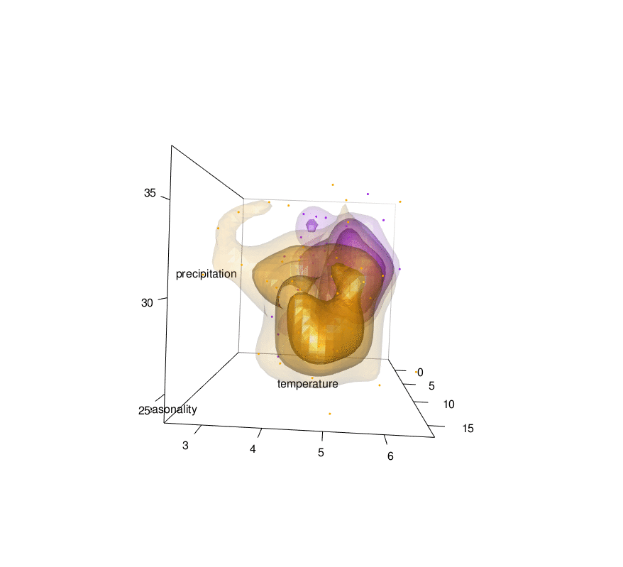

# **Javi's site**

This is a test web site.

## Links

1. my github profile [https://github.com/jabiologo](https://github.com/jabiologo)

2. my [blog](https://allthiswasfield.blogspot.com/)

3. the rWind R package [CRAN link](https://cran.r-project.org/web/packages/rWind/index.html).

4. more research in my [Google Schoolar](https://scholar.google.es/citations?hl=es&user=v3biyuIAAAAJ)

### [link test](http://allthiswasfield.blogspot.com/)

