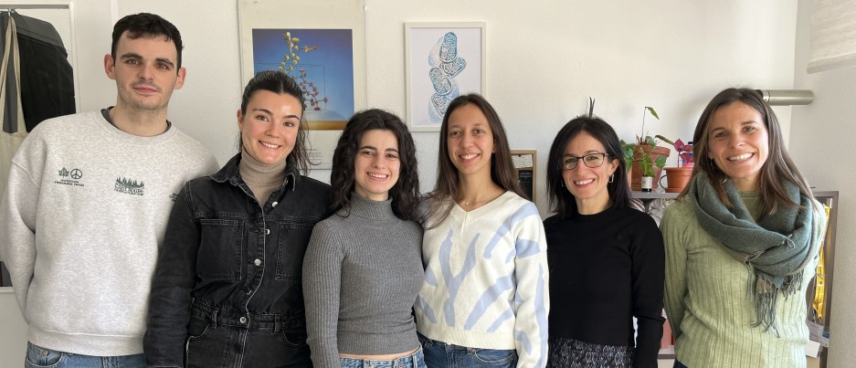
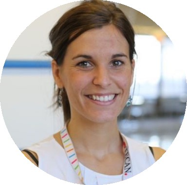
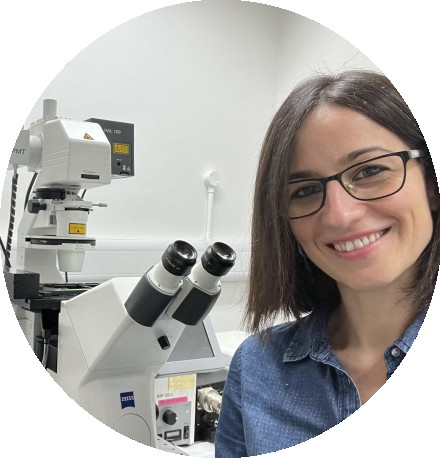

<section class="hero">

Neuroscience · Universidad Complutense de Madrid<h1>MitoGlia <em>LAB</em></h1>
Understanding the role of <strong>mitochondria</strong> and <strong>microglia</strong> in the development of neurodegenerative diseases.

<a class="button primary" href="papers.html">Explore our research ↗</a><a class="button " href="labmembers.html">Meet the team ↗</a>

<figure class="hero-visual"><figcaption class="image-caption">MitoGlia Lab · Madrid, Spain</figcaption></figure>
</section>

<h2>Our research</h2>

<article class="research-card">01 / MITOCHONDRIA<h3>Energy, calcium &amp; cell fate</h3>
Investigating how mitochondrial function and calcium signalling influence neuronal health and tau-related disease.
</article>
<article class="research-card">02 / MICROGLIA<h3>The brain’s immune cells</h3>
Exploring how LRRK2, lipid metabolism and inflammatory responses shape microglial function in Parkinson’s disease.
</article>
<article class="research-card">03 / NEUROPROTECTION<h3>Nrf2 &amp; cannabinoid signalling</h3>
Studying Nrf2 and cannabinoid signalling to understand cellular resilience and identify therapeutic opportunities.
</article>

<section class="about-lab">
<h2>About the lab</h2>

We are <strong>Elisa Navarro and Noemí Esteras</strong>, two principal investigators joining forces to understand the molecular basis of neurodegenerative diseases. Our laboratory is based at the School of Medicine, <a href="https://www.ucm.es/">Universidad Complutense de Madrid</a>.

From microglia to neurons, transcriptomics to live imaging, and mitochondria to lipid metabolism, we bring complementary approaches to Alzheimer’s disease, Parkinson’s disease and frontotemporal dementia.

We are committed to a supportive environment for learning, collaboration, independence and growth.

</section>

<article class="pi-card">
<h3>Elisa Navarro</h3>
Microglia · Neuroinflammation · LRRK2
<a href="elisa.html">Meet Elisa →</a> &nbsp; <a href="https://orcid.org/0000-0002-4056-7146">ORCID ↗</a>
</article><article class="pi-card">
<h3>Noemí Esteras</h3>
Mitochondria · Calcium · Tau
<a href="noemi.html">Meet Noemí →</a> &nbsp; <a href="https://orcid.org/0000-0002-7938-6131">ORCID ↗</a>
</article>

