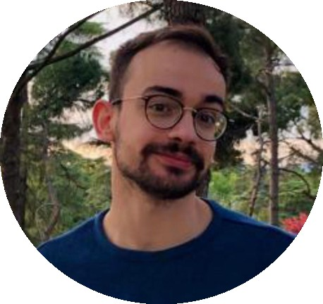

```{=html}
<style type="text/css">
.title {
  display: none;
}

main-container {
  max-width: 1800px;
  margin-left: auto;
  margin-right: auto;
}

body {
text-align: justify
}

</style>
```

# **Here you can meet the whole team!**

### **Santiago Rodríguez Carreiro**

 </a>

Santi is a Biochemistry graduate from UCM and holds of a Master's in Neuroscience from the Autonomous University of Madrid (UAM). Currently, Santi is a **Ph.D student** in Biochemistry, Molecular Biology, and Biomedicine at UCM. 

His research centers on Parkinson's disease and explores the endocannabinoid system as a potential therapeutic avenue, employing diverse methodologies such as cell cultures, animal models and histological and biochemical assays. Apart from his academic pursuits, Santi enjoys board games, humming tunes in the lab, and collecting coins.

</br>
</br>
</br>
</br>

### **Sara Pardo Calderón**

Sara graduated in Biochemistry in 2023 and she is currently a **Master student** of Biochemistry, Molecular Biology and Biomedicine Master at UCM. 

Her project focuses on exploring the endocannabinoid receptor GPR55. More specifically, she is using a knock-out model of this receptor to study the potential role of GPR55 in the development of Parkinson´s disease. Her work will help to decipher the potential suitability of GPR55 as a target for neuroportection. 

</br>
</br>
</br>
</br>
</br>

### **Alicia Caro Martín**

Alicia is an **undergraduate student** of Biochemistry and she is doing her end-of-degree project in the lab under the supervision of Elisa Navarro and Jorge Montesinos.  

Alicia is interested in studying microglia functionality in context of physiology and under pro-inflammatory situations. She is currently optimizing different experimental approaches in the lab for isolating and culturing microglia, as well as functional assays to study its functionality.

</br>
</br>
</br>
</br>
</br>

### **David Jiménez Galán**

David is an **undergraduate student** of Biochemistry, currently working in the lab for his end-of-degree project under the supervision of Noemí Esteras. 

David is focusing on studying the effects of Tau protein in neuronal functionality. He works with neuronal cell lines and primary cultures with the aim of exploring how Tau protein alters mitochondrial biology. 

</br>
</br>
</br>
</br>
</br>
</br>

### **Sara Carmona Lorenzo**

Sara is an **undergraduate student** of Biochemistry and she is doing her end-of-degree project in the lab under the supervision of Elisa Navarro and Noemí Esteras. 

Sara´s project focuses in using Nrf2 inducers as potential neuroprotective agents in neurodegenerative diseases. More specifically, she is studying the functional effect of inducing Nrf2 in different cell types and disease models, in order to positionate this approach for clinical development. 

</br>
</br>
</br>
</br>
</br>
</br>

# **Alumni**

### **Leire García Megía**

Leire has a degree in Biochemistry from the UCM. Leire successfully completed her end-of-degree project in the lab titled *Role of LRRK2 and lipid metabolism in the activity of microglial cells* under the supervision of Elisa Navarro and Jorge Montesinos.

### **Musab Al-Abrash Ghalyoun**

Musab has a degree in Veterinary and Neuroscience Master from the UCM. Musab completed his final project of the Master in the lab titled *Characterization of a new model of Parkinson´s disease based in alpha-synucelin injection* under the supervision.


