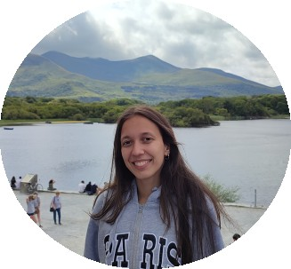
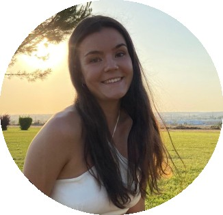
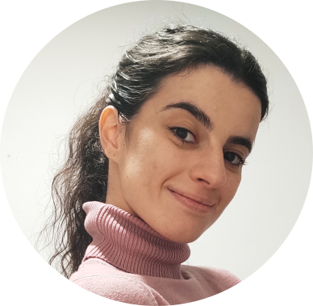
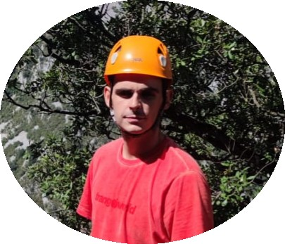
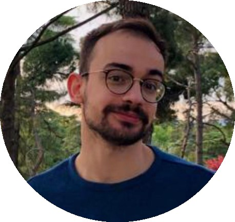

<h1>Lab members</h1>
Here you can meet the whole team!

## PhD students

::: {.member-grid}

::: {.member-card}

PhD student

### Mamen Nogales Valenciano

Mamen graduated in Sanitary Biology in University of Alcalá and has Master in Biochemistry from UCM. She is currently a  **PhD student** of Mitoglia Lab with a CAM fellowship.

Her project focuses on exploring how mutations in *LRRK2* gene affect microglial biology. She is working with the G2019S knock-in strain and she is performing primary microglial cultures as well as *in vivo* approaches to better understand how this gene may affect microglial biology. If you don´t find Mamen in the lab, for sure she will be dancing bachata some where in Madrid... And if not, maybe playing Secret Code while having some ice-cream.

:::

::: {.member-card}

PhD student

### Lucía Íñigo Catalina

Lucía is a Biochemistry graduate from UCM and holds a Master's in Molecular Biomedicine from the Autonomous University of Madrid (UAM). Lucía is a **PhD student**  in the lab under the supervision of Noemí Esteras and Lisa Rancán.

Lucía´s project focuses in understanding how different mutations in Tau associated to frontotemporal dementia can affect neuronal functionality, focusing on mitochondrial biology and calcium signaling. She is developing different experimental approaches, including neuronal cell lines, primary cultures and patient-derived neuronal lines obtained from iPSCs. Apart from neurons and mitochondria, she loves sports, crime books and nature. She also loves spending time in her village located in Guadalajara with family and friends.

:::

::: {.member-card}

PhD student

### María Ortiz Cabello

María is a Biochemistry graduate from UCM and holds a Master's in Traslational Medicine from the Complutense University of Madrid (UCM). María is a **PhD student**  in the lab under the supervision of Elisa Navarro, Noemí Esteras and Sergio Paredes.

María is trying to figure out the role of Nrf2 in different pathological conditions, including LRRK2 and Tau-related disorders. She combines neuronal and glial primary cultures with in vivo models to understand how Nrf2 gets dysregulated in disease and to find new ways to promote neuroprotection. Beyond Nrf2, María loves concerts and music festivals—or just hopping on a plane to anywhere in the world. Even though she loves living in Madrid, she always feels the need to escape back to her hometown, Cáceres.

:::

::: {.member-card}

PhD student

### David Jiménez Galán

David is a **PhD student** in the lab under the supervision of Noemí Esteras.

David is focusing on studying the effects of Tau protein in neuronal functionality. He works with neuronal cell lines carrying different Tau mutations with the aim of exploring how Tau protein alters mitochondrial biology and calcium signalling. Beyond Tau, David loves playing table tennis and he is passionate about Real Madrid and nature. He also loves spending time with his friends!

:::

:::

## PhDs defended in the lab

::: {.member-grid}

::: {.member-card}

PhD defended

### Santiago Rodríguez-Carreiro

Santi is a Biochemistry graduate from UCM and holds a Master's in Neuroscience from the Autonomous University of Madrid (UAM). Santi defended his PhD in Biochemistry, Molecular Biology, and Biomedicine at UCM, carrying out his doctoral research in the lab.

His doctoral research focused on Parkinson's disease and explored the endocannabinoid system as a potential therapeutic avenue, employing diverse methodologies such as cell cultures, animal models and histological and biochemical assays. Apart from his academic pursuits, Santi enjoys board games, humming tunes in the lab, and collecting coins.

:::

:::

## Alumni

::: {.alumni-grid}

::: {.member-card}

Alumni

### Sara Carmona Lorenzo

Sara carried out her Master project in the lab under the supervision of Elisa Navarro and Noemí Esteras.

Her project focused in using Nrf2 inducers as potential neuroprotective agents in neurodegenerative diseases. More specifically, she studied the functional effect of inducing Nrf2 in different cell types and disease models associated to Parkinson, in order to evaluate this approach for clinical development. Apart from the lab, Sara loves dancing, specially flamenco and jotas, as well as reading thrillers. She also enjoys walking her dog and spending time with her family and friends.

:::

::: {.member-card}

Alumni

### Sara Pardo Calderón

Sara has a degree and Master in Biochemistry from the UCM. Sara successfully completed her Master project in the lab titled *Investigating the role of GPR55 in Parkinson´s disease* under the supervision of Elisa Navarro (2023-2024).

:::

::: {.member-card}

Alumni

### Irene Rodrigo Herrero

Irene has a Master in Neuroscience from the UCM. Irene successfully completed her Master project in the lab titled *Evaluating the activation of Nrf2 for the treatment of frontotemporal dementia associated to Tau* under the supervision of Noemí Esteras (2023-2024).

:::

::: {.member-card}

Alumni

### Alicia Caro

Alicia has a degree in Biochemistry from the UCM. Alicia successfully completed her end-of-degree project in the lab titled *Studying the role of LRRK2 in the microglial inflammatory response* under the supervision of Elisa Navarro and Jorge Montesinos (2023-2024).

:::

::: {.member-card}

Alumni

### Leire García Megía

Leire has a degree in Biochemistry from the UCM. Leire successfully completed her end-of-degree project in the lab titled *Role of LRRK2 and lipid metabolism in the activity of microglial cells* under the supervision of Elisa Navarro and Jorge Montesinos (2022-2023).

:::

::: {.member-card}

Alumni

### Musab Al-Abrash Ghalyoun

Musab has a degree in Veterinary and Neuroscience Master from the UCM. Musab completed his final project of the Master in the lab titled *Characterization of a new model of Parkinson´s disease based in alpha-synucelin injection* under the supervision of Elisa Navarro (2021-2022).

:::

:::
