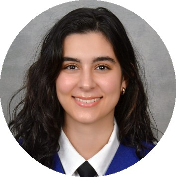

```{=html}
<style type="text/css">
.title {
  display: none;
}

main-container {
  max-width: 1800px;
  margin-left: auto;
  margin-right: auto;
}

body {
text-align: justify
}

</style>
```

# **Here you can meet the whole team!**

### **Santiago Rodríguez-Carreiro**

 </a>

</br>
</br>

Santi is a Biochemistry graduate from UCM and holds of a Master's in Neuroscience from the Autonomous University of Madrid (UAM). Currently, Santi is a **Ph.D student** in Biochemistry, Molecular Biology, and Biomedicine at UCM. 

His research centers on Parkinson's disease and explores the endocannabinoid system as a potential therapeutic avenue, employing diverse methodologies such as cell cultures, animal models and histological and biochemical assays. Apart from his academic pursuits, Santi enjoys board games, humming tunes in the lab, and collecting coins.

</br>
</br>
</br>
</br>

### **Sara Pardo Calderón**

 </a>

</br>
</br>


Sara graduated in Biochemistry in 2023 and she is currently a **Master student** of Biochemistry, Molecular Biology and Biomedicine Master at UCM. 

Her project focuses on exploring the endocannabinoid receptor GPR55. More specifically, she is using a knock-out model of this receptor to study the potential role of GPR55 in the development of Parkinson´s disease. Her work will help to decipher the potential suitability of GPR55 as a target for neuroprotection. Besides the lab, Sara takes advantage of any time of the day to watch suspense series and police cases. And if she is watching a movie, it's 100% guaranteed to be scary!

</br>
</br>
</br>
</br>
</br>

### **Lucía Íñigo Catalina**

 </a>

</br>
</br>


Lucía is a Biochemistry graduate from UCM and holds of a Master's in Molecular Biomedicine from the Autonomous University of Madrid (UAM). Lucía is a **PhD student**  in the lab under the supervision of Noemí Esteras and Lisa Rancán.  

Lucía´s project focuses in understanding how different mutations in Tau associated to frontotemporal dementia can affect neuronal functionality, focusing on mitochondrial biology and calcium signaling. She is developing different experimental approaches, including neuronal cell lines, primary cultures and patient-derived neuronal lines obtained from iPSCs. Apart from neurons and mitochondria, she loves sports, crime books and nature. She also loves spending time in her village located in Guadalajara with family and friends. 

</br>
</br>
</br>
</br>
</br>

### **David Jiménez Galán**

 </a>

</br>

David is an **undergraduate student** of Biochemistry, currently working in the lab for his Master project under the supervision of Noemí Esteras. 

David is focusing on studying the effects of Tau protein in neuronal functionality. He works with neuronal cell lines carrying different Tau mutations with the aim of exploring how Tau protein alters mitochondrial biology and calcium signalling. Beyond Tau, David loves playing table tennis and he is passionate about Real Madrid and nature. He also loves spending time with his friends!

</br>
</br>
</br>
</br>
</br>
</br>

### **Sara Carmona Lorenzo**

 </a>

</br>
Sara is an **undergraduate student** of Biochemistry and she is doing her Master project in the lab under the supervision of Elisa Navarro and Noemí Esteras. 

Sara´s project focuses in using Nrf2 inducers as potential neuroprotective agents in neurodegenerative diseases. More specifically, she is studying the functional effect of inducing Nrf2 in different cell types and disease models associated to Parkinson, in order to positionate this approach for clinical development. Apart from the lab, Sara loves dancing, specially flamenco and jotas, as well as reading thrillers. She also enjoys walking her dog and spending time with her family and friends. 

</br>
</br>
</br>
</br>
</br>
</br>

# **Alumni**

### **Sara Pardo Calderón**

Sara has a degree and Master in Biochemistry from the UCM. Sara successfully completed her Master project in the lab titled *Investigating the role of GPR55 in Parkinson´s disease* under the supervision of Elisa Navarro (2023-2024).

### **Irene Rodrigo Herrero**

Irene has a Master in Neuroscience from the UCM. Irene successfully completed her Master project in the lab titled *Evaluating the activation of Nrf2 for the treatment of frontotemporal dementia associated to Tau* under the supervision of Noemí Esteras (2023-2024).

### **Alicia Caro**

Alicia has a degree in Biochemistry from the UCM. Alicia successfully completed her end-of-degree project in the lab titled *Studying the role of LRRK2 in the microglial inflammatory response* under the supervision of Elisa Navarro and Jorge Montesinos (2023-2024).

### **Leire García Megía**

Leire has a degree in Biochemistry from the UCM. Leire successfully completed her end-of-degree project in the lab titled *Role of LRRK2 and lipid metabolism in the activity of microglial cells* under the supervision of Elisa Navarro and Jorge Montesinos (2022-2023).

### **Musab Al-Abrash Ghalyoun**

Musab has a degree in Veterinary and Neuroscience Master from the UCM. Musab completed his final project of the Master in the lab titled *Characterization of a new model of Parkinson´s disease based in alpha-synucelin injection* under the supervision of Elisa Navarro (2021-2022).


