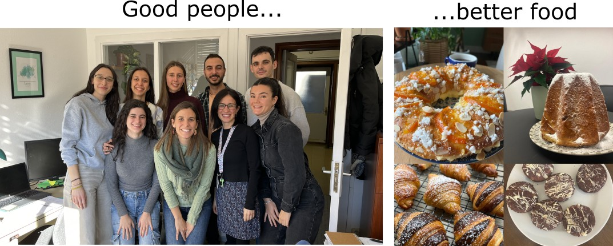
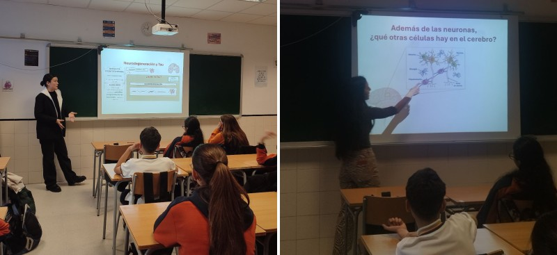
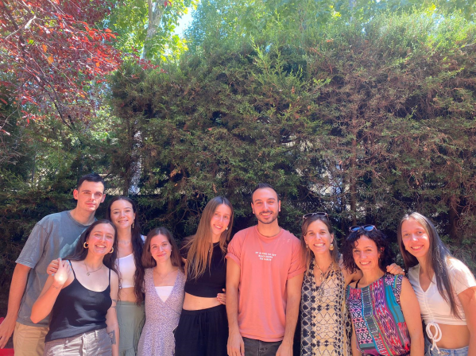
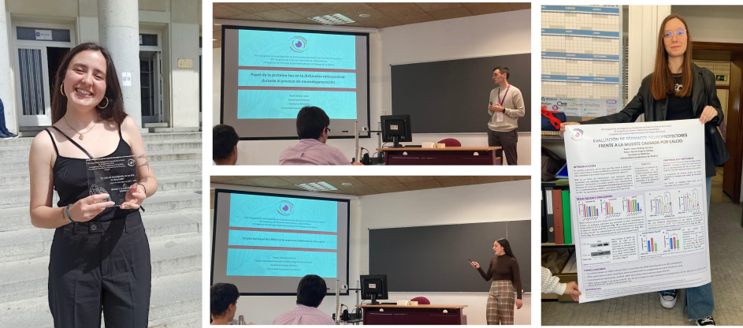
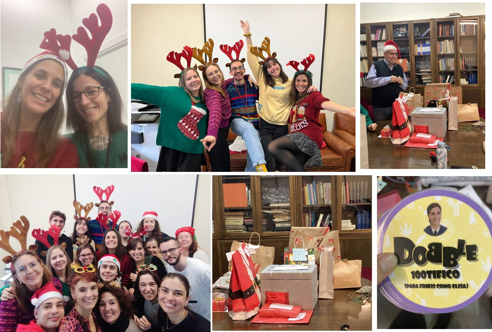
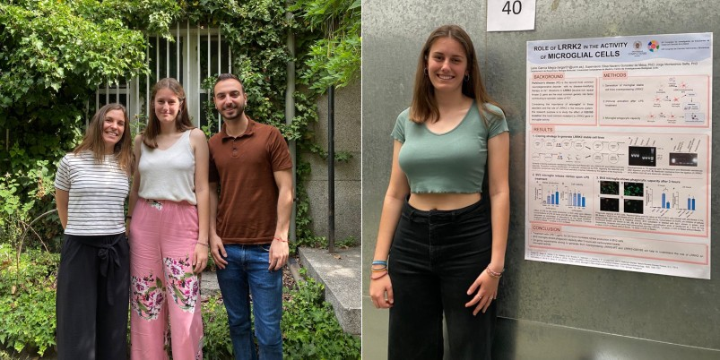
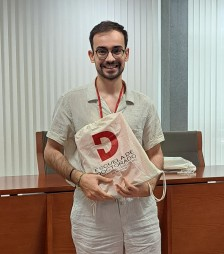

<h1>News &amp; lab events</h1><a class="button" href="papers.html">See our latest publications →</a>

::: {.archive}

::: {.event}

## **Loving MAMitoGliers**

Every month Montesinos´ and MitoGlia´s labs gather together to discuss science and enjoy homemade Noemi´s recipes. Here you can see a summary of what these last months have meant

:::

::: {.event}

## **Día de la niña y la mujer en la Ciencia**

Mamen and Lucía celebrated the day of Girls and Women in Science visiting GSD Las Suertes school to bring the research they are doing to high school students

:::

::: {.event}

## **Celebrating the success after a hard 2024 academic year!**

June 2024 has been exhausting! Santi did amazing (as always!) in #Farmadrid30 & Sara Pardo in CEBBM presenting their work about GPR55 in the context of Parkinson. Moreover, David, Sara and Alicia rocked in the defense of their final degree projects. Plus, Mamen is officially a new PhD student of the #Mitoglia Lab after receiving a competitive CAM fellowship. No more excuses needed to go out and celebrate!

:::

::: {.event}

## **Student´s conference at UCM 2024**

This year we have had a great representation at the UCM Student´s Conference, with 3 talks and 2 poster presentations from the Mitoglia Lab!! Huge congratulations to all students for amazing work in the conference and especially to Alicia Caro for winning prize for the best talk!

:::

::: {.event}

## **Christmas party & gift exchange 2023**

2023 comes to the end and it´s not all about work...We also have to celebrate the achievements of the year

:::

::: {.event}

## **Leire´s defense**

In June 2023, Leire successfully defended her end-of-degree project. Congrats Leire!! It´s being great to have you in the lab!

:::

::: {.event}

## **Santi, prize to the best presentation!**

We are so happy of Santi´s winning the 3rd prize to the best oral communication in the *BBM students conference* at UCM. Congrats Santi, you have done it great!!

:::

:::
