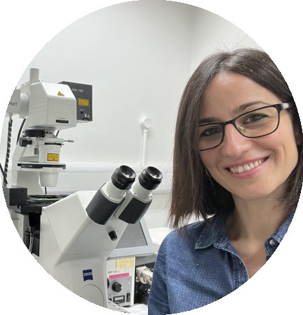

```{=html}
<style type="text/css">
.title {
  display: none;
}

main-container {
  max-width: 1800px;
  margin-left: auto;
  margin-right: auto;
}

body {
text-align: justify
}

</style>
```

# **Meet Noemí Esteras**
<a href = "https://www.researchgate.net/profile/Noemi-Esteras">  </a>

## **About me**
I graduated in Pharmacy (2007) and obtained a PhD in Biochemistry and Molecular Biology (2012) from UCM. My doctoral research, developed in the lab of Ángeles Martín-Requero at CIB/CSIC, focused on understanding the role of cell cycle deregulation in the pathogenesis of Alzheimer´s disease.

I then joined the lab of Prof. Andrey Abramov at the UCL Queen Square Institute of Neurology, in London, where I developed most of my research career, first as a postdoc and later as Senior Research Fellow. My main line of work focused on understanding the interaction of mitochondria, oxidative stress and calcium signalling in neurodegeneration, and, in particular, in tau-related frontotemporal dementia. I also studied the role of Nrf2 as a modulator of mitochondrial function, both in brain physiology and as a therapeutic strategy in neurodegeneration.

In 2023 I obtained a competitive Ramón y Cajal Fellowship from the Ministry of Science and joined the Department of Biochemistry at the UCM School of Medicine. I belong to the [Cannabinoids research group](https://www.ucm.es/grupos/grupo/73), and have recently obtained funding from the Ministry of Science to establish my independent research line. In addition, I currently teach Neurochemistry at the UCM Master of Neuroscience, and Human Molecular Genetics to medical students at UCM.


## **Ongoing projects**

As a continuation of the line of work developed in my years in London, my main interest
concentrates around mitochondria and their different physiological and pathological roles in
the mechanism of neurodegeneration.

**MITOTAU**

Among their vital functions, mitochondria buffer and shape cytosolic calcium signals, which are
essential for neuronal activity. In our previous works, we found that tau protein, which is
involved in many different neurodegenerative conditions, alters the way mitochondria handles
calcium. Specifically, we discovered it inhibits NCLX, the Na + /Ca 2+ exchanger that pumps

calcium out of the mitochondria. The impairment of the mitochondrial calcium efflux leads to
calcium overload inside the mitochondria, which is a trigger for neuronal death.
In the present project, recently funded by the Ministry of Science (PID2022-137011OA-I00), we
aim to delve deeper in the molecular mechanisms leading to this impairment, its possible role
as a biomarker and the evaluation of disease-modifying approaches targeting mitochondrial
calcium for tauopathies. As a model, we will employ iPSC-derived neurons from patients
among others.

**NRF2 TARGETING IN NEURODEGENERATION**

The transcription factor Nrf2 has emerged in the last years as an important modulator of multiple aspects of mitochondrial function. Given the importance of mitochondria in the development of multiple neurodegenerative diseases, I am interested in the study of the potential therapeutic role of pharmacological activation of Nrf2 in neurodegeneration.


### **Learn more about my research**

1. more research in my [ResearchGATE](https://www.researchgate.net/profile/Noemi-Esteras) 

2. my [Scopus](https://www.scopus.com/authid/detail.uri?authorId=24833089500)
