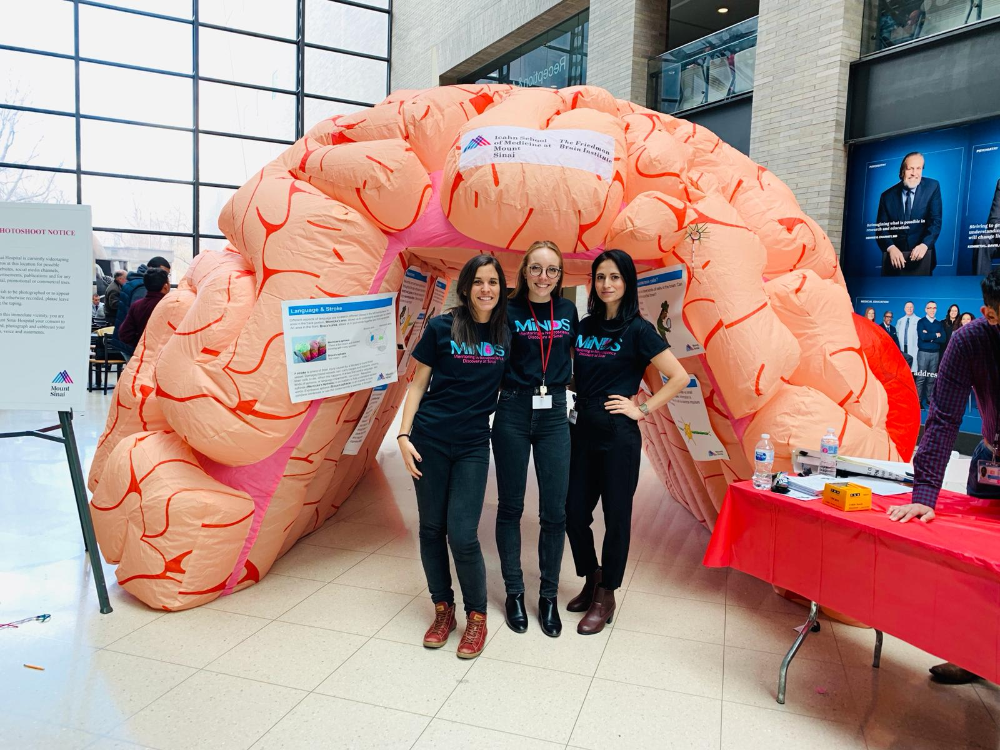
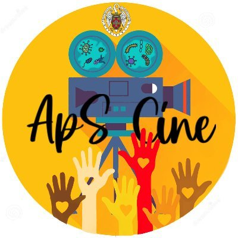

```{=html}
<style type="text/css">
.title {
  display: none;
}

main-container {
  max-width: 1800px;
  margin-left: auto;
  margin-right: auto;
}

body {
text-align: justify
}

</style>
```

### *We are committed to promote scientific advocacy and make neuroscience more accessible to the public*

As part of our mission we actively participate in a variety of events aiming to promote scientific advocacy at different levels

</br>
</br>

### **Semana de la Ciencia (Week of Science)**

Every year, we participate in the Week of Science. We prepare activities for secondary education students. With these activities, they can learn different techniques that we use in the lab, from tissue staining to imaging. They also learn about brain´s anatomy and fun facts about the endocannabinoid system. 

</br>
</br>

### **hala bedi podcast**

In collaboration with Carmen Rubio, Elisa participated in the *critical thinking* section. With this iniciative, we aimed to disseminate our current understanding of Alzheimer´s and Parkinson´s as well as our work in the lab to the general public. You can listen [here](https://halabedi.eus/es/ciencia-alzheimer-y-parkinson/) to the podcast (in Spanish!)

</br>
</br>

### **Brain Awareness week at Mount Sinai**

 </a>

Elisa has participated in [Brain Awareness week](https://icahn.mssm.edu/research/friedman/events/brain-awareness-week) at Mount Sinai. This iniciative is driven by [MiNDs](https://www.mindatsinai.com/). The mission  aims to bring brain research closer to middle school students. In the picture, Elisa, Madison Parks & Saima Machlovi (former colleagues from Mount Sinai) using a giant brain to explain the structure and functions to the students.

</br>
</br>
</br>
</br>

</br>
</br>

### **Service-learning**

 </a>

Outreach, academic learning and serving the community meet at *Service-learning* project. Noemí and Elisa actively participate in this initiative organized at UCM. Our project is entitled *"Movies in Company for Preventing Diseases"*. Our goal is to engage students in learning activities, while addressing health-related issues of people at risk of social exclusion in their local environment. With this project, we aim to bring the students scientific and academic knowledge to different communities. You can learn more about our project in this [Youtube video](https://www.youtube.com/watch?v=BmR9KQ0c9es)

</br>
</br>
</br>
</br>

### **Community Impact (Columbia University)**

From 2018-2020, Elisa was part of *Community Impact*, a nonprofit organization dedicated to serving people in need in the Morningside Heights, Harlem, and Washington Heights communities. Elisa participated as a volunteer in the *adult education program*, helping adults prepare for the GED exam.  You can learn more about the iniciative [here](https://www.google.com/url?sa=t&rct=j&q=&esrc=s&source=web&cd=&ved=2ahUKEwjg9NKZpd-DAxVBnf0HHa-QC4YQFnoECA4QAQ&url=https%3A%2F%2Fwww.communityimpact.columbia.edu%2F&usg=AOvVaw1QdfJFHanFqgdAwEXdo02x&opi=89978449)


