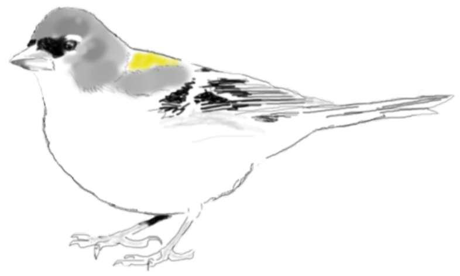

<style>
body {
text-align: justify}
</style>

```{r setup, include=FALSE}
knitr::opts_chunk$set(echo = TRUE, message=FALSE,warning=FALSE)
```
<br/><br/>

A menudo, los investigadores que trabajan con la naturaleza deben confiar en estudios observacionales, es decir, analizar los **patrones** que pueden ser observados en el campo e intentar inferir los **procesos** que los han producido. Un investigador podría, a partir del patrón de las localizaciones de presencia de una especie y su relación con ciertas variables ambientales, inferir el proceso mediante el cual ciertas circunstancias ambientales condicionan la distribución de la misma. Por esta razón y desde un punto de vista didáctico, para comprender los modelos de distribución de las especies,  puede resultar eficaz utilizar el enfoque en sentido contrario: **simular** el proceso que genera el patrón de distribución e intentar inferirlo a partir de los patrones observados.
<br/><br/>
En esta práctica aprenderemos a simular la distribución de una especie _virtual_ utilizando un proceso de puntos de Poisson no homogéneo (IPP o IPPP del inglés: Inhomogeneous Poisson (Point) Process). Después, realizaremos un muestreo aleatorio de nuestra población y ajustaremos un **modelo** lineal para comprobar si somos capaces de **comprender** el efecto de nuestras covariables y de **predecir** la distribución de nuestra especie. 

# Simulación de un Proceso de Poisson no Homogéneo

Vamos a simular una población de pinzón vulgar _Fringilla coelebs_, un ave principalmente forestal que en la Península Ibérica se alimenta de insectos pero también de yemas y brotes, frutos carnosos o semillas. Nuestro área de estudio será un sector cuadrado de 100 x 100 kilómnetros situado en la Península Ibérica dividido en cuadrículas de 1 km². Simularemos un proceso mediante el cual la abundancia de pinzones esté condicionada por la distancia a un punto de agua y por la cobertura forestal. En hábitats mediterráneos los puntos de agua actúan como atractores de todo tipo de fauna y recursos debido al frecuente estrés hídrico al que están sometidos estos ambientes. La cobertura forestal proporciona al pinzón tanto refugio como una fuente de alimento debido a los insectos, frutos y semillas que están asociados a los bosques.
<br/><br/> 
```{r, out.width = "600px", echo = FALSE, fig.align = "center"}

```


Dibujo: [José Luis Tellería](https://scholar.google.es/citations?user=r6kE5m0AAAAJ&hl=es)

<br/><br/> 

En primer lugar instalaremos y cargaremos los paquetes que vamos a necesitar en esta práctica.
```{r ch1}
set.seed(123)
#install.package("raster")
library(raster)
library(spatstat)

```
A continuación crearemos las dos covariables o variables predictoras que van a gobernar la abundancia de pinzones en nuestro área de estudio, que de momento dejaremos vacía de pinzones.
```{r ch2,fig.height = 6, fig.width = 11.2, fig.align = "center"}
# Creamos un raster de 100 x 100 cuadrículas que dejaremos vacío por el momento
sarea <- raster(nrows = 100, ncols = 100, xmn = 0, xmx = 100, ymn = 0, ymx = 100)
# Creamos un punto de agua en la coordenada X=25 Y=25 y a partir de este punto
# generamos una capa de distancia al punto de agua "dwat"
dwat <- scale(distanceFromPoints(sarea, c(25,25))) + 2.26
# Creamos una índice de cobertura arbórea
forest <- raster(nrows = 10, ncols = 10, xmn = 0, xmx = 100, ymn = 0, ymx = 100)
forest[] <- runif(100, 1,10)
forest <- disaggregate(forest,10, "bilinear")
# Podemos ahora visualizar estas dos capas
par(mfrow = c(1,2))
plot(dwat); plot(forest)

```

Una vez tenemos nuestras covariables o predictores ambientales, podemos crear un Proceso de Poisson no Homogéneo para "repartir" nuestros pinzones en nuestro área de estudio. Recordamos que
\begin{equation}
\tag{Eq 1}\label{eq1}
N_i \sim Poiss(\lambda_i)
\end{equation}

donde $N_i$ sería el número de pinzones en la celda _i_, mientras que $\lambda_i$ sería el parámetro _lambda_ para la distribución de Poisson que genera la abundancia de pinzones en la celda _i_. Esa $\lambda$ o "número de pinzones esperado por cuadrícula" es la que vendrá determinada en función de nuestras covariables ambientales, siguiendo la fórmula

\begin{equation}
\tag{Eq 2}\label{eq2}
log(\lambda_i) = \beta_0 + \beta_1 * X_{1i} + \beta_2 * X_{2i}
\end{equation}

siendo $\beta_0$, $\beta_1$ y $\beta_2$ el intercepto y los "estimates" que modifican el efecto de nuestras covariables ambientales en la celda _i_ respectivamente: $X_{1i}$ (distancia al punto de agua) y $X_{2i}$ (cobertura forestal).
Como somos nosotros quienes vamos a *simular el proceso* mediante el cual se distribuyen nuestros pinzones, debemos elegir los valores de $\beta_0$, $\beta_1$ y $\beta_2$. Por ejemplo

*   $\beta_{0} = 0.2$
*   $\beta_{1} = -0.9$
*   $\beta_{2} = 0.15$

Como vemos, hemos hecho que la distancia al punto de agua afecte negativamente a la abundancia de pinzones (cuanto más nos alejamos del punto de agua menor número de pinzones), mientras que la cobertura forestal afecta positivamente al número de pinzones. Ahora sólo nos quedaría resolver la ecuación en cada una de las cuadrículas de la celda para obtener el $\lambda$ en cada celda de nuestro área de estudio, realizando la siguiente operación

\begin{equation}
\tag{Eq 3}\label{eq3}
\lambda_i = exp(0.2 - (0.9 * dwat) + (0.15 * forest))
\end{equation}
<br/><br/> 

```{r ch3,fig.height = 6, fig.width = 6, fig.align = "center"}
# Definimos las betas que vamos a utilizar
beta0 <- 0.2
beta1 <- -0.9
beta2 <- 0.15

# Creamos una función que, tomando los valores de dwat y forest, nos calcule 
# la lambda según nuestra fórmula
ff <- function(dwat,forest){exp(beta0 + (beta1*(dwat)) + (beta2*(forest)))}

# Ejecutamos la función y visualizamos el resultado
rotate <- function(x) t(apply(x, 2, rev))
lambda <- as.im(rotate(matrix(ff(dwat[],forest[]),100,100, byrow=TRUE)))
plot(lambda)
```

Ya disponemos del parámetro $\lambda$ para cada una de las celdas de nuestro área de estudio. Para simular nuestra población tan solo tenemos que ejecutar la función `rpoispp` del paquete `spatstat`, la cual genera un patrón de puntos siguiento un proceso de Poisson dad0 un valor de $\lambda$.

```{r ch4,fig.height = 6, fig.width = 6, fig.align = "center"}
pinzones <- rpoispp(lambda)
plot(pinzones, cex = 0.3, pch=19, main = "Localización de pinzones en nuestro área de estudio")
pinzones
```

Podemos ahora realizar diferentes visualizaciones de nuestros datos, como dividir nuestro área de estudio en 100 cuadrículas de 10x10 kilómetros y contar el número de pinzones. O crear una función de densidad en 3 dimensiones que represente la abundancia de pinzones en nuestro área de estudio.

```{r ch5,fig.height = 12, fig.width = 11.4, fig.align = "center"}
Q10 <- quadratcount(pinzones, nx = 10, ny = 10)
dpinzones <- density(pinzones, sigma = 7)
par(mfrow = c(2,2))
plot(dwat, main = "Distancia al punto de agua")
plot(forest, main = "Cobertura forestal")
plot(Q10, main = "Nº de pinzones en cada cuadrícula de 10 x 10 km")
persp(dpinzones, theta = 1, phi = 30, main = "Densidad de pinzones")
```


